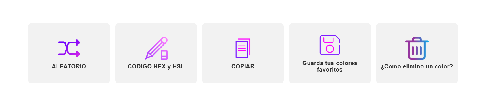

<p align="center">
  
</p>

## 📖 Descripción

ColorFly Studio es una aplicación web desarrollada para generar paletas de colores de forma rápida e intuitiva. Permite crear combinaciones armónicas para proyectos de diseño web, aplicaciones móviles, identidad visual y branding.

El usuario puede generar colores aleatorios, bloquear aquellos que desea conservar, copiar códigos HEX o HSL y guardar sus colores favoritos.

---

## ✨ Características

- 🎲 Generación aleatoria de paletas.
- 🔒 Bloqueo individual de colores.
- 📋 Copia de códigos HEX y HSL.
- 💾 Guardado de colores favoritos.
- 🗑 Eliminación de colores guardados.
- 🎨 Selección de 6, 8 o 9 colores.
- 📱 Diseño adaptable (Responsive).
- ⚡ Interfaz moderna y fácil de usar.

---

## 🖥️ Capturas

### Página principal


### Colores guardados


### Indicaciones de como usar



---

## 🛠 Tecnologías utilizadas

- HTML5
- CSS3
- JavaScript
- Flexbox
- Grid
- Git
- GitHub

---

## 🚀 Cómo usar

1. Clona el repositorio.

```bash
git clone https://github.com/cesarmanzano1/ProyectoM1_MANZANO-CESAR-LUI.git
```

2. Entra en la carpeta.

```bash
cd PROYECTO-MODULO1_MANZANO CESAR LUIS
```

3. Abre el archivo **index.html** en tu navegador.

---
4. o entra en el siguiente enlace : https://cesarmanzano1.github.io/ProyectoM1_MANZANO-CESAR-LUIS/

## 🎯 Funcionalidades

### Generar colores

Pulsa el botón **Generar Paletas** para crear una nueva combinación de colores.

### Codigo HEX Y HSL

Pulsa el botón **HEX O HSL** para seleccionar el tipo de codigo que deceas esto es para las paletas y los colores guardados.

### Bloquear colores

Haz clic sobre un color para bloquearlo y evitar que cambie al generar una nueva paleta.

### Desbloquear colores

Haz clic sobre un color  bloquedo para desbloquearlo o  si tienes muchos colores precina el espacio blanco de habajo y se desbloquearan todos los colores .

### Copiar colores

Haz doble clic sobre un color para copiar automáticamente su código esto es para las paletas o los colores guardados.

### Guardar colores

Presiona el botón **Guardar** para almacenar los colores bloqueados.

### Eliminar colores

Selecciona los colores guardados y presiona **Eliminar**.

---

## 📂 Estructura

```
Proyecto/
│
├── img/
├── Documentacion/
├── index.html
├── styles.css
├── script.js
└── README.md
```

---

## 👨‍💻 Autor

**César Luis Manzano**

- GitHub: https://github.com/cesarmanzano1
- LinkedIn: https://www.linkedin.com/in/cesar-luis-manzano/

---

## 📄 Licencia

Este proyecto fue desarrollado con fines educativos.
